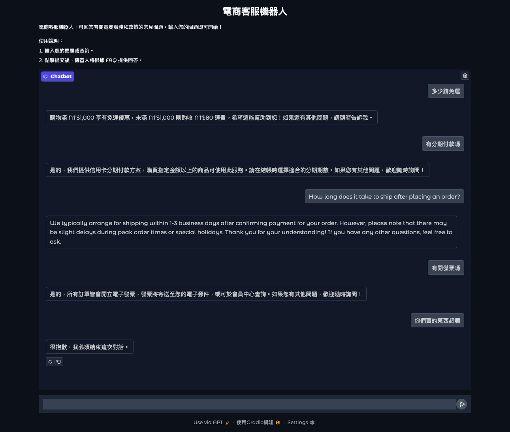

# FAQ Chatbot

此專案是一個用於各式場景的 FAQ 機器人，與一般基於關鍵字匹配的傳統機器人不同，本專案結合 LLM 技術，使機器人能夠理解更自然的語言輸入，而不僅僅依賴關鍵字搜尋。

- 語意理解更強：即使用戶沒有使用完全相同的關鍵字，機器人仍然能夠理解問題的意圖並提供適當回答。
- 對話更加流暢：透過 LLM 技術，機器人可以根據上下文調整回應，而不只是單純地輸出預定義的答案。
- 更接近真人互動：相較於傳統 FAQ 系統只能根據簡單的 if-else 邏輯比對，LLM 使得機器人能夠生成更自然、靈活的回應。

它利用預先設定的 FAQ 資料來回應用戶問題，幫助自動化店家的常見問題管理。該工具配合 JSON 檔案儲存問題與规則，確保答案準確而且避免給出正确但不在檔案中的答案，並能夠適應不同的語句變化，同時保持高準確度的回答。

