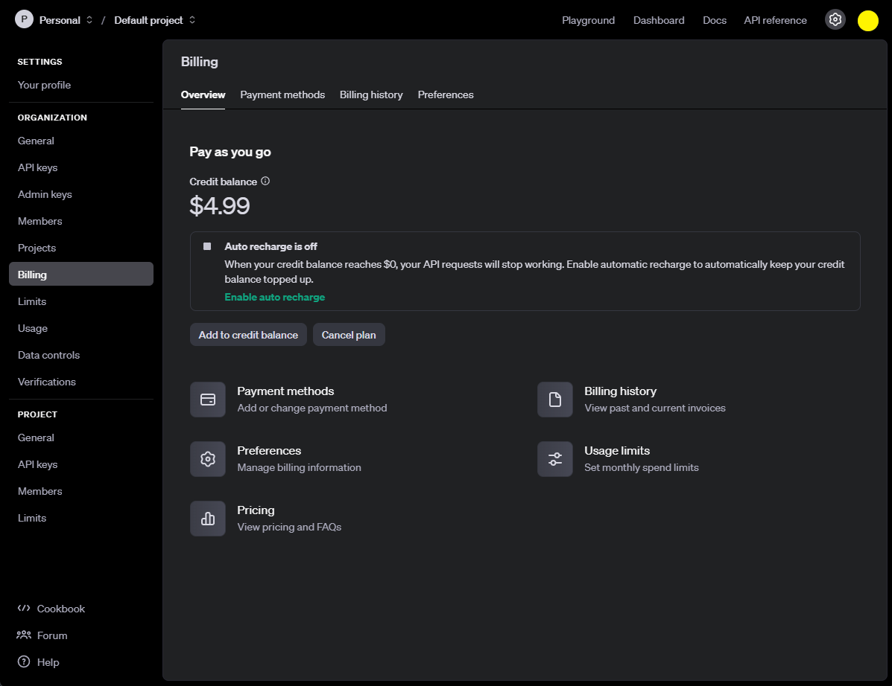

# LLM

### OpenAI API

- [Tokens 計算機](https://platform.openai.com/tokenizer)
- [Tokens 價格](https://openai.com/api/pricing/)

##### Parameter

| 參數                    | 說明                                                                                     | 範例值                                                                                         |
| ----------------------- | ---------------------------------------------------------------------------------------- | ---------------------------------------------------------------------------------------------- |
| **`model`**             | 指定使用的模型名稱                                                                       | `"gpt-3.5-turbo"`                                                                              |
| **`messages`**          | 對話訊息列表，每個訊息包含 `role` 和 `content`。角色可為 `system`、`user`、`assistant`。 | `[{"role": "system", "content": "你是一個友善的助手。"}, {"role": "user", "content": "你好"}]` |
| **`temperature`**       | 控制生成文本的隨機性，範圍 0-2，較高值生成更隨機的文本                                   | `0.7`                                                                                          |
| **`top_p`**             | 「核取樣」的機率，範圍 0-1，指定生成時只考慮累積概率質量達到此值的標記                   | `0.9`                                                                                          |
| **`n`**                 | 指定生成多少個回應選項                                                                   | `1`                                                                                            |
| **`stream`**            | 若設為 `true`，回應將以流式傳送回應內容                                                  | `False`                                                                                        |
| **`stop`**              | 設定停止字串，當生成文本包含這些字串時停止生成                                           | `["\n"]`                                                                                       |
| **`max_tokens`**        | 限制生成文本的最大 token 數量                                                            | `100`                                                                                          |
| **`presence_penalty`**  | 增加模型引入新主題的可能性，範圍 -2.0 到 2.0                                             | `0.5`                                                                                          |
| **`frequency_penalty`** | 降低模型重複相同語句的可能性，範圍 -2.0 到 2.0                                           | `0`                                                                                            |
| **`logit_bias`**        | 調整特定 token 的生成概率                                                                | `{50256: -100}`                                                                                |
| **`user`**              | 用戶識別符，用於追蹤和監控，協助 OpenAI 檢測濫用行為                                     | `"user123"`                                                                                    |

##### Models

| 模型                 | 說明                                                                                |
| -------------------- | ----------------------------------------------------------------------------------- |
| **GPT-4o**           | 最新的高階多模態模型，處理文字、語音和圖像輸入，效能更高，成本更低。                |
| **GPT-4-turbo**      | GPT-4 的優化版本，效能更高、成本更低，適合在效能和效費間需要平衡的應用。            |
| **GPT-3.5-turbo**    | 高效版的 GPT-3.5 模型，是 GPT-3 系列中的一個改良版本，在成本和效能上達到較好平衡。  |
| **GPT-3.5**          | 類似於 GPT-4，但效能較低，適合一般對話應用。                                        |
| **Text-Davinci-003** | GPT-3 系列的精確版，具有強大文本生成和理解能力，適合更複雜的自然語言處理任務。      |
| **Embedding Models** | 用於嵌入生成的模型，如 `text-embedding-ada-002`，適合文本相似度、分類和搜尋等應用。 |
| **Code-Davinci-002** | 專門用於程式碼生成的模型，適合程式碼自動生成、錯誤排查、重構等任務。                |
| **Whisper-1**        | 語音轉文本模型，適用於語音識別，能夠將語音訊號轉換成文本。                          |
| **OpenAI o1**        | 增強推理能力的模型，特別適用於科學與數學領域。                                      |
| **OpenAI o3**        | 提供更強推理能力，適用於更高階的應用需求。                                          |
| **OpenAI o3-mini**   | 輕量版的 o3 模型，兼具效能與成本考量。                                              |
| **DALL·E**           | 生成式 AI 圖像模型，可根據文本輸入生成高品質圖像。                                  |
| **CLIP**             | 多模態模型，能夠理解並關聯圖像與文本，適用於圖像分類、標註等應用。                  |
| **Triton**           | OpenAI 的高效運算框架，用於提升模型推理與訓練效能。                                 |
| **Shap-E**           | 3D 物件生成模型，可根據文本輸入生成 3D 模型。                                       |
